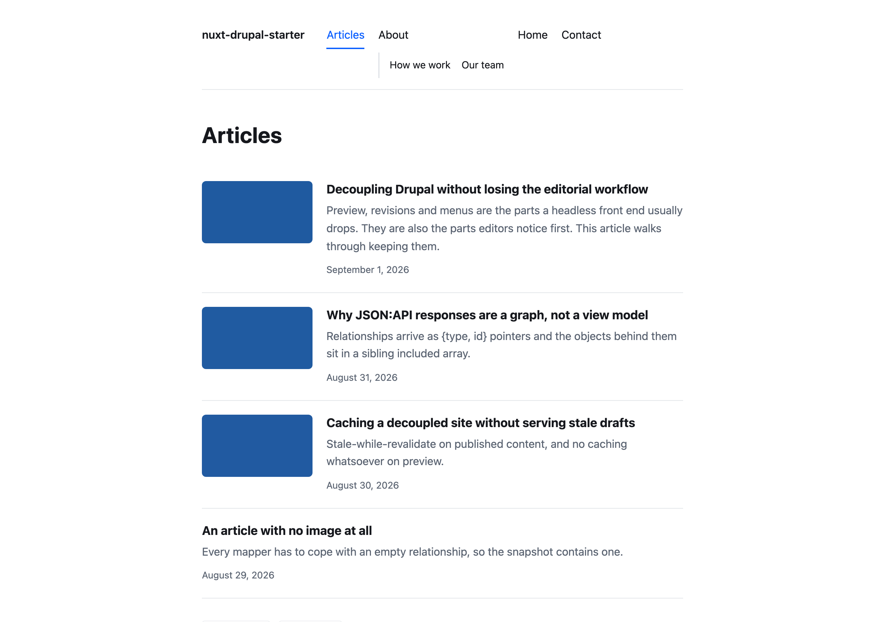
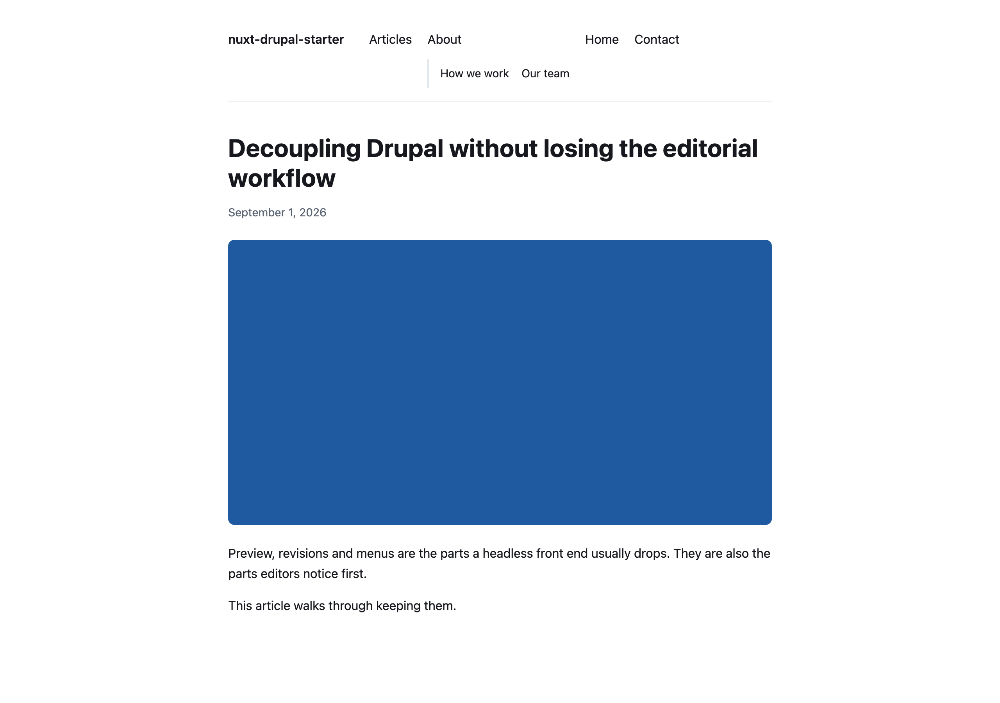
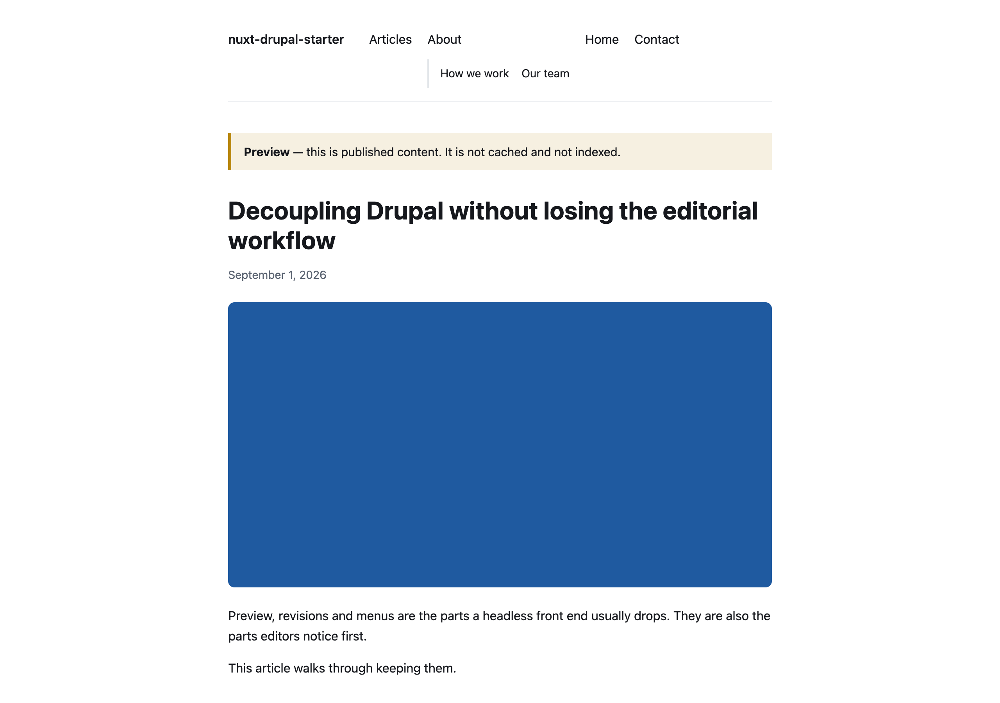
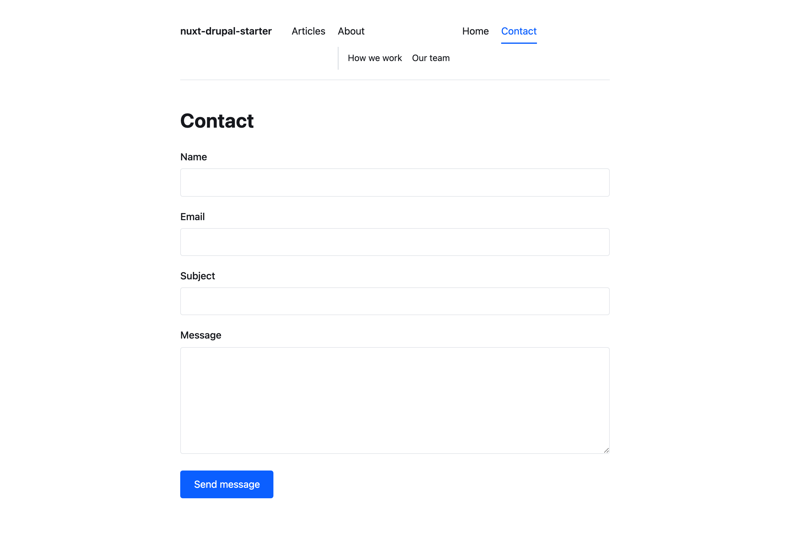

# nuxt-drupal-starter

Production-oriented Nuxt 4 starter for decoupled Drupal 11: typed JSON:API,
editor preview, cache invalidation, menus, media and forms — with the backend
pieces Drupal 11 does not yet have.

[](https://github.com/mykolapodpriatov/nuxt-drupal-starter/actions/workflows/ci.yml)


[](./LICENSE)


**[Architecture](./ARCHITECTURE.md) · [Decisions](./docs/adr) ·
[Quick start](#quick-start) · [Deployment](./docs/deployment.md)**

---

## Why this exists

Pairing Drupal with a modern front end is solved in theory and rebuilt from
scratch in practice. This starter takes a position on the four things every such
project gets wrong, and — more usefully — on the four things Drupal 11 currently
cannot do at all.

**JSON:API is a graph, not a view model.** Relationships arrive as `{type, id}`
pointers into a sibling `included` array. Rendering straight from that shape
couples every component to Drupal's storage model, so a field rename breaks a
template three layers away. Transport types and domain models are kept separate
here, bridged by one mapper. ([ADR-001](./docs/adr/001-transport-dto-vs-domain-model.md))

**Four things need a backend module, because contrib has no stable Drupal 11
release.** This is the current state of the ecosystem, and the main reason this
repository is worth having:

| Need | Usual answer | Status | Here |
|---|---|---|---|
| Read menus | `jsonapi_menu_items` | no stable D11 release | `nuxt_menu`, ~60 lines |
| Resolve a URL alias | `decoupled_router` | no stable D11 release | `nuxt_router`, ~50 lines |
| Accept a form | `webform` | no stable D11 release | `nuxt_contact`, ~50 lines |
| Preview + invalidation | — | — | `nuxt_preview` |

Each is small on purpose. If those modules stabilise, three of these should be
deleted, and losing them costs nothing.

**Preview must be authenticated and uncached at the same time.** Editors expect
to see drafts; the public must not. Signed, expiring links with the expiry
*inside* the signature, constant-time comparison, and failure closed when the
secret is unset. ([ADR-005](./docs/adr/005-preview-and-revalidation.md))

**Credentials must stay on the server.** In Nuxt the boundary between a
server-only secret and a value published to every visitor is one indentation
level. It is asserted twice: once against the config, once against the bytes in
the built bundle.

## Quick start

**No Drupal required.** With `NUXT_DRUPAL_BASE_URL` unset, the app serves a
snapshot captured from a real Drupal 11 — including the images.

```bash
corepack enable
pnpm install
pnpm dev
```

Against a live backend:

```bash
cp .env.example .env    # set NUXT_DRUPAL_BASE_URL
pnpm dev
```

To build the reference backend the snapshot came from — requires DDEV and
Docker:

```bash
cd drupal && ./setup.sh
```

## What it does

| | |
|---|---|
|  |  |
| **Listing** — paginated, cursor in the URL so a page is linkable | **Article** — at whatever alias the editor chose |
|  |  |
| **Preview** — signed link, unpublished content, never cached or indexed | **Contact** — validated on both sides, honeypot, rate-limited |

Also: Drupal-driven menus including code-defined links, responsive media with
intrinsic dimensions, SEO metadata and JSON-LD, a generated sitemap, cache
invalidation on content save, and a security-headers baseline with a
per-request CSP nonce.

## Verification

```bash
pnpm verify      # lint + typecheck + unit tests + build — what CI runs
pnpm test:e2e    # Playwright against a production build, including axe
pnpm test:scan   # scan the built bundle for leaked secrets
```

CI runs lint, typecheck and unit tests as three parallel jobs on Node 22 and 24,
then builds, then scans the bundle, then runs the browser suite.

## Design notes

The decisions worth knowing before reading the code. Each has an ADR.

**Fixtures are captured, not written.** Writing the mappers from the spec
produced two wrong assumptions — `field_image` on core's article recipe points
straight at `file--file` rather than through a media entity, and alt text lives
on the *relationship*, not the file. Both render as "this article has no image",
indistinguishable from one that has none. Hand-written fixtures would have been
written from the same wrong assumptions.
([ADR-002](./docs/adr/002-fixture-snapshot-vs-live-backend.md))

**JSON:API cannot resolve a URL alias.** `path` is a computed field. Both
plausible spellings fail, and differently:

```
filter[path.alias]=/blog/hello   → 500  "'path' not found"
filter[path][alias]=/blog/hello  → 400  "You must provide a valid filter condition."
filter[status]=1                 → 200  ✓
```

That last line is what makes it confusing until the computed-field distinction
lands. ([ADR-004](./docs/adr/004-path-resolution.md))

**Menus need `administer menu` — and would still be incomplete.** Core JSON:API
serves *entities*, and links defined in code by a module (`standard.front_page`,
the "Home" item on a stock Drupal) have no `menu_link_content` record. A
fully-privileged consumer still renders a navigation missing exactly the items
nobody thinks to check. ([ADR-003](./docs/adr/003-menu-endpoint.md))

**JSON:API stays read-only.** `read_only: false` is global: switching it off to
accept a contact form opens the write surface of every entity type the requester
can touch, to anyone who finds the endpoint.
([ADR-006](./docs/adr/006-writes-and-security-headers.md))

**Two bugs that only a browser could find.** Both are recorded because they are
the argument for end-to-end tests against a real build:

- A Nitro plugin registered without `defineNitroPlugin` loads and never fires
  its hooks. Every security header was silently missing.
- `script-src 'self'` blocks Nuxt's inline bootstrap, so **the application never
  hydrated**. Every page rendered correctly and nothing was interactive. Fixed
  with a per-request nonce rather than `'unsafe-inline'`.

Unit tests passed throughout. The headers were present and looked right.

**Nothing is prerendered.** A prerendered route is served by the static handler,
so Nitro's render hooks never run — the security headers were absent on the most
public page in the app — and a per-request nonce baked into a static file is a
constant.

**Type-aware linting covers `.ts` but not `.vue`.** The rules worth having need
type information, which is brittle through `vue-eslint-parser` for SFC
templates. Components are still fully type-checked by `vue-tsc`.

## License

[MIT](./LICENSE)
